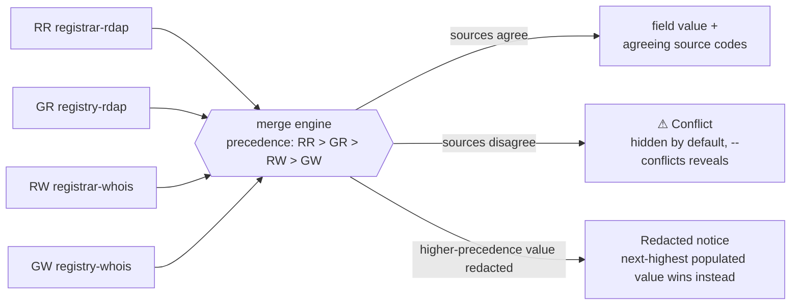

<div align="center">

# plat

**Domain lookups, reconciled — RDAP and WHOIS, together**

[](https://github.com/patramsey/plat/releases)
[](https://github.com/patramsey/plat/actions/workflows/ci.yml)
[](https://codecov.io/gh/patramsey/plat)
[](https://github.com/patramsey/plat/releases/latest)
[](go.mod)
[](LICENSE)

Look up a domain's registration record — RDAP and WHOIS, queried
concurrently from both registry and registrar, merged into one record with
**per-field source provenance**: which source supplied each value, and
where sources disagree.

</div>

---


*(Recorded with [vhs](https://github.com/charmbracelet/vhs) — see
[`docs/demo.tape`](docs/demo.tape) for the source script.)*

## Contents

- [Why not just `whois` or an RDAP client?](#why-not-just-whois-or-an-rdap-client)
- [Install](#install)
- [Usage](#usage)
- [IP Lookups](#ip-lookups)
- [ASN Lookups](#asn-lookups)
- [Output & Provenance](#output--provenance)
  - [Source codes](#source-codes)
  - [Conflicts](#conflicts)
  - [Redaction and contacts](#redaction-and-contacts)
  - [Lifecycle](#lifecycle)
  - [Human view vs. JSON](#human-view-vs-json)
- [Exit Codes](#exit-codes)
- [Changelog](CHANGELOG.md)
- [Contributing](CONTRIBUTING.md)
- [License](#license)

## Why not just `whois` or an RDAP client?

Domain registration data lives in two parallel, incompatible worlds.
**WHOIS** (RFC 3912) is plaintext over port 43 — no schema, wildly
inconsistent formats per registry/registrar, and a referral chain
(IANA → registry → registrar) you have to follow by hand. **RDAP**
(RFC 7480–7484, 9082, 9083) is structured JSON over HTTPS, but coverage is
incomplete (plenty of ccTLDs still don't run it), registrar RDAP quality
varies widely, and it redacts contact data differently than WHOIS does for
the same domain.

No single source is complete. Registry and registrar data genuinely
differ (thin vs. thick), and RDAP/WHOIS for the same domain often disagree
or redact different fields outright. The usual workaround: run `whois`,
squint at unparseable text, try an RDAP client, diff the two mentally.

`plat` queries all four sources — registry RDAP, registrar RDAP, registry
WHOIS, registrar WHOIS — **concurrently**, merges them into one record, and
shows exactly where every field came from and where sources disagree,
instead of making you do that reconciliation by hand.

## Install

**Homebrew (macOS / Linux):**
```bash
brew install patramsey/tap/plat
```

**Download a release binary:**
```bash
# macOS (Apple Silicon)
curl -L https://github.com/patramsey/plat/releases/latest/download/plat_darwin_arm64.tar.gz | tar xz
sudo mv plat /usr/local/bin/

# macOS (Intel)
curl -L https://github.com/patramsey/plat/releases/latest/download/plat_darwin_amd64.tar.gz | tar xz
sudo mv plat /usr/local/bin/

# Linux (amd64)
curl -L https://github.com/patramsey/plat/releases/latest/download/plat_linux_amd64.tar.gz | tar xz
sudo mv plat /usr/local/bin/
```

All platforms and checksums on the [releases page](https://github.com/patramsey/plat/releases).

**Go install:**
```bash
go install github.com/patramsey/plat/cmd/plat@latest
```
This builds from source without goreleaser's version stamping — `plat version`
will show `dev` instead of a real version/commit/date, since that's only
injected via `-ldflags` at release build time.

## Usage

```bash
# Basic lookup — auto-detects a styled human view on a terminal, plain
# text when piped
plat example.com

# Multiple domains in one invocation
plat example.com example.org

# IP-address lookup — the netblock and its holding organization, from
# the RIR's RDAP + WHOIS, merged the same way (see "IP Lookups" below)
plat 8.8.8.8
plat 2001:4860:4860::8888

# ASN lookup — the autonomous system and its holding organization (see
# "ASN Lookups" below)
plat AS15169

# Machine-readable output
plat example.com -o json | jq .expires.value
plat example.com example.org -o ndjson

# Include raw source payloads alongside the merged record
plat example.com -o json --raw

# Compare a fresh lookup against a saved -o json snapshot -- reports
# what changed (expiry, nameservers, status, ...) and exits 4 if
# anything did. Works for domains, IPs, and ASNs.
plat example.com -o json > before.json
plat --diff before.json example.com

# --diff compares merged values only, not provenance, so a source that
# flaps between runs (a rate-limited RIR, a timed-out registrar WHOIS)
# does not itself trigger exit 4 as long as the remaining sources still
# agree on each field's underlying value. It can still under- or
# over-report a change if that flap removes a field's only supplying
# source, or flips a value's serialized precision/format without
# changing the underlying fact -- see internal/diff's package doc
# comment for the exact edge cases.

# Restrict which sources are queried
plat example.com --source rdap       # registry + registrar RDAP only
plat example.com --source whois      # registry + registrar WHOIS only
plat example.com --source registry   # registry RDAP + registry WHOIS only
plat example.com --source registrar  # registrar RDAP + registrar WHOIS only

# Skip the registrar RDAP related-link hop
plat example.com --no-follow

# One-line summary per domain (lock status, expiry, conflict count)
# instead of the full view -- ignored for -o json/ndjson
plat example.com -q

# Adjust the per-source timeout (default 5s)
plat example.com --timeout 10s

# Show the per-source diagnostic block: which sources were attempted,
# their latency, and their status. Also surfaces this detail when a
# lookup fails outright, not just on success.
plat example.com -v

# Show the full per-source breakdown for every conflicted field. Without
# this, a conflicted field is still marked (⚠ in the human view,
# [conflict] in plain — never silently hidden) — this flag just reveals
# what each source actually reported.
plat example.com --conflicts

# Force a fresh fetch of the IANA RDAP bootstrap file, bypassing the
# cached copy
plat example.com --refresh-bootstrap

# Disable color output -- same effect as setting NO_COLOR (any
# non-empty value: https://no-color.org/), which plat also honors
plat example.com --no-color
NO_COLOR=1 plat example.com

# Version and shell completions
plat version
plat --version                # equivalent shortcut
plat version -o json          # machine-readable
plat version --full           # include Go version and platform
plat completion bash > /etc/bash_completion.d/plat
plat completion zsh > "${fpath[1]}/_plat"
plat completion fish > "$(dirname "$(command -v fish)")/../share/fish/vendor_completions.d/plat.fish"
plat completion powershell > plat.ps1
```

## IP Lookups

`plat` also looks up IP addresses: `plat 8.8.8.8` or `plat
2001:4860:4860::8888` finds the RIR (ARIN, RIPE NCC, APNIC, LACNIC, or
AFRINIC) that holds the containing netblock and queries its RDAP and
WHOIS, merged with the same per-field provenance as a domain lookup.

There's no registrar leg — an IP allocation has no registrar — so only
`registry-rdap`/`registry-whois` ever appear as sources, and the fields
are a netblock's own (handle, CIDR, start/end address, parent handle,
holding organization) rather than a domain's (registrar, nameservers,
expiry, DNSSEC). `-o json` sets `"objectType": "ip"` to distinguish the
shape from a domain record's `"objectType": "domain"`; see
[`docs/schema.md`](docs/schema.md) for the full field reference.
Reserved/private addresses (`10.0.0.1`, `127.0.0.1`, `::1`, ...) are
rejected up front with a usage error, since no RIR allocates them to an
organization.

## ASN Lookups

`plat` also looks up autonomous system numbers: `plat AS15169` finds the
RIR that holds the ASN and queries its RDAP and WHOIS, merged with the
same per-field provenance as a domain or IP lookup. The `AS` prefix is
required (case-insensitive) — a bare number like `plat 15169` is treated
as a (invalid, single-label) domain rather than an ASN, since it's likelier
a typo than an intentional ASN lookup.

Like an IP lookup, there's no registrar leg, so only
`registry-rdap`/`registry-whois` ever appear as sources. The fields are an
autonomous system's own (handle, AS name, start/end autnum range, holding
organization) rather than a domain's or netblock's. `-o json` sets
`"objectType": "asn"` to distinguish the shape from a domain or IP
record's; see [`docs/schema.md`](docs/schema.md) for the full field
reference.

## Output & Provenance



*(Expires is the one exception to strict precedence: on a genuine
conflict, it picks the earliest disputed date instead — see below.)*

### Source codes

Every field carries the sources that agreed on its value, shown as a
2-letter code — `RR` registrar-rdap, `GR` registry-rdap, `RW`
registrar-whois, `GW` registry-whois — rather than full names, since that
badge repeats on every field and full names ("registrar-rdap, registry-rdap,
registry-whois") added up to real visual noise on a well-agreed-upon record.
A one-line legend decoding the codes prints once per lookup in the
human/plain views.

`-o json`/`-o ndjson` keep full source names in `sources[]` — machine
consumers don't need the abbreviation, and it isn't part of the stable
schema. String comparisons are normalized (case, whitespace, a trailing
period) before sources are judged to agree or disagree, so formatting-only
differences never show up as noise.

### Conflicts

Where sources genuinely disagree, the conflict is recorded, not silently
dropped:

- The field is marked — `⚠` in the human view, `[conflict]` in plain —
  never invisible either way.
- The top summary shows a running conflict count.
- `--conflicts` reveals every disagreeing source's exact value
  (off by default, so a domain with several noisy timestamp/nameserver
  disagreements doesn't dominate the view).
- `-o json`'s `conflicts[]` array always includes the full detail regardless
  of the flag — machine output has no "too much detail" problem.

Expires is the one field where a conflict changes which value wins: it shows
the earliest disputed date rather than the usual highest-precedence source,
since assuming more runway than you actually have is the riskier mistake for
an expiration date. Every other field keeps the highest-precedence value
even in conflict.

### Redaction and contacts

GDPR-style redaction is modeled explicitly, not mistaken for a literal
contact name — the same handling covers the Registrar Name field itself,
when a registrar's own identity comes back redacted.

**Registrant/admin/tech/billing contact details are deliberately not
shown**, for two reasons:

- Since ICANN's 2018 GDPR Temporary Specification, the large majority of
  that data comes back redacted from every source anyway — building out
  full contact parsing would mostly render "REDACTED FOR PRIVACY" over and
  over, not real ownership data.
- RDAP represents contacts as jCard (RFC 7095) — a deliberately unpleasant
  format to parse defensively — and WHOIS's own contact-block conventions
  are even less consistent than its other fields.

`plat` spends its effort on the fields that *are* reliably available and
comparable across all four sources — registrar identity, dates, nameservers,
status, abuse contact — where per-field provenance actually earns its keep.
(Registrar Abuse Email/Phone are shown: they're the registrar's own
operational contact, not a registrant's personal data, and aren't typically
redacted.)

### Lifecycle

For a gTLD domain that's expired, `plat` interprets its EPP status into a
plain-language lifecycle stage — Auto-Renew Grace Period, Redemption Grace
Period, Pending Restore, or Pending Delete — with an estimated (never
confirmed) end date wherever ICANN's Expired Registration Recovery Policy
(ERRP) or a common registry convention gives one a fixed or capped
duration to derive from. Only Redemption Grace's 30 days is actually
ICANN-mandated (ERRP §3.1); Auto-Renew Grace's 45 days is a registry
convention (e.g. Verisign's for `.com`/`.net`), and ERRP explicitly leaves
registrars free to act sooner at their own discretion. It's shown as its
own section in the human/plain views and as a `lifecycle` object in JSON
(see [`docs/schema.md`](docs/schema.md)); ccTLDs, internationalized (IDN)
TLDs, and domains without a recognized lifecycle-relevant status don't get
one.

### Human view vs. JSON

The styled human view (default on a real terminal, or forced with
`-o human`) leads with an at-a-glance summary — lock status, expiry
countdown, conflict count — inside a bordered box color-coded to match: a
domain locked down with transfer/update/delete protections gets a calm
green border, one with something actively wrong (held, pending delete) gets
red. EPP status codes are color-coded the same way. The Registrar URL is a
clickable OSC 8 hyperlink in terminals that support it, and degrades to
plain text everywhere else (including pipes, where all styling and the
hyperlink are stripped automatically).

The `-o json`/`-o ndjson` wire format is a versioned, stable schema,
unaffected by `-v` or any of the styling above — see
[`docs/schema.md`](docs/schema.md) for the full field-by-field reference.
`--diff -o json` emits a different, separately-versioned schema (a report
of what changed, not a record) and doesn't emit the record schema at all —
see `docs/schema.md`'s `--diff` output section.

## Exit Codes

| Code | Meaning |
|---|---|
| `0` | At least one source returned usable data (and, with `--diff`, nothing changed) |
| `1` | Every attempted source agrees the domain doesn't exist |
| `2` | Usage error (bad flag, invalid domain input) |
| `3` | Total lookup failure (no source reachable, or ambiguous failure state) |
| `4` | `--diff` found at least one changed field |

For multiple domains in one invocation, the overall exit code is the worst
of every individual domain's code.

Exit `4` only fires once the lookup itself has actually succeeded — a
not-found or a total-failure result still exits `1` or `3`, so a monitoring
script checking `$?` never mistakes "the domain vanished" for "something
changed."

Exit `1` is checking-availability's "good" outcome, not an error — and it
reads that way in the human view too. `plat unregistered-example.com`
prints `is not registered (checked: registry-rdap)` in the same calm color
as a locked status or a successful DNSSEC check, not the red used for exit
`3`.

Exit `3`'s message distinguishes two different failure shapes:

- a total connectivity failure: `lookup failed — no sources could be
  reached`
- a mixed result where non-existence can't be confirmed: `lookup
  inconclusive — N of M sources failed`

## License

[MIT](LICENSE)
