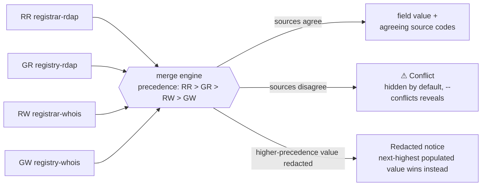

# plat

Look up a domain's registration record — RDAP and WHOIS, queried
concurrently from both registry and registrar, merged into one record with
**per-field source provenance**: which source supplied each value, and
where sources disagree.


*(Recorded with [vhs](https://github.com/charmbracelet/vhs) — see
[`docs/demo.tape`](docs/demo.tape) for the source script.)*

## Why not just `whois` or an RDAP client?

Domain registration data lives in two parallel, incompatible worlds.
**WHOIS** (RFC 3912) is plaintext over port 43 — no schema, wildly
inconsistent formats per registry/registrar, and a referral chain
(IANA → registry → registrar) you have to follow by hand. **RDAP**
(RFC 7480–7484, 9082, 9083) is structured JSON over HTTPS, but coverage is
incomplete (plenty of ccTLDs still don't run it), registrar RDAP quality
varies widely, and it redacts contact data differently than WHOIS does for
the same domain.

No single source is complete. Registry and registrar data genuinely
differ (thin vs. thick), and RDAP/WHOIS for the same domain often disagree
or redact different fields outright. The usual workaround: run `whois`,
squint at unparseable text, try an RDAP client, diff the two mentally.

`plat` queries all four sources — registry RDAP, registrar RDAP, registry
WHOIS, registrar WHOIS — **concurrently**, merges them into one record, and
shows exactly where every field came from and where sources disagree,
instead of making you do that reconciliation by hand.

## Install

```bash
# From within a checkout of this repo (works today):
go install ./cmd/plat

# Once published (not yet — this repo is currently local-only):
# go install github.com/patramsey/plat/cmd/plat@latest
# brew install patramsey/tap/plat
# — or download a prebuilt binary from the Releases page
```

## Usage

```bash
# Basic lookup — auto-detects a styled human view on a terminal, plain
# text when piped
plat example.com

# Multiple domains in one invocation
plat example.com example.org

# Machine-readable output
plat example.com -o json | jq .expires.value
plat example.com example.org -o ndjson

# Include raw source payloads alongside the merged record
plat example.com -o json --raw

# Restrict which sources are queried
plat example.com --source rdap       # registry + registrar RDAP only
plat example.com --source whois      # registry + registrar WHOIS only
plat example.com --source registry   # registry RDAP + registry WHOIS only
plat example.com --source registrar  # registrar RDAP + registrar WHOIS only

# Skip the registrar RDAP related-link hop
plat example.com --no-follow

# Adjust the per-source timeout (default 5s)
plat example.com --timeout 10s

# Show the per-source diagnostic block: which sources were attempted,
# their latency, and their status. Also surfaces this detail when a
# lookup fails outright, not just on success.
plat example.com -v

# Show the full per-source breakdown for every conflicted field. Without
# this, a conflicted field is still marked (⚠ in the human view,
# [conflict] in plain — never silently hidden) — this flag just reveals
# what each source actually reported.
plat example.com --conflicts

# Force a fresh fetch of the IANA RDAP bootstrap file, bypassing the
# cached copy
plat example.com --refresh-bootstrap

# Version and shell completions
plat version
plat completion bash > /etc/bash_completion.d/plat
plat completion zsh > "${fpath[1]}/_plat"
```

## Output & Provenance



*(Expires is the one exception to strict precedence: on a genuine
conflict, it picks the earliest disputed date instead — see below.)*

### Source codes

Every field carries the sources that agreed on its value, shown as a
2-letter code — `RR` registrar-rdap, `GR` registry-rdap, `RW`
registrar-whois, `GW` registry-whois — rather than full names, since that
badge repeats on every field and full names ("registrar-rdap, registry-rdap,
registry-whois") added up to real visual noise on a well-agreed-upon record.
A one-line legend decoding the codes prints once per lookup in the
human/plain views.

`-o json`/`-o ndjson` keep full source names in `sources[]` — machine
consumers don't need the abbreviation, and it isn't part of the stable
schema. String comparisons are normalized (case, whitespace, a trailing
period) before sources are judged to agree or disagree, so formatting-only
differences never show up as noise.

### Conflicts

Where sources genuinely disagree, the conflict is recorded, not silently
dropped:

- The field is marked — `⚠` in the human view, `[conflict]` in plain —
  never invisible either way.
- The top summary shows a running conflict count.
- `--conflicts` reveals every disagreeing source's exact value
  (off by default, so a domain with several noisy timestamp/nameserver
  disagreements doesn't dominate the view).
- `-o json`'s `conflicts[]` array always includes the full detail regardless
  of the flag — machine output has no "too much detail" problem.

Expires is the one field where a conflict changes which value wins: it shows
the earliest disputed date rather than the usual highest-precedence source,
since assuming more runway than you actually have is the riskier mistake for
an expiration date. Every other field keeps the highest-precedence value
even in conflict.

### Redaction and contacts

GDPR-style redaction is modeled explicitly, not mistaken for a literal
contact name — the same handling covers the Registrar Name field itself,
when a registrar's own identity comes back redacted.

**Registrant/admin/tech/billing contact details are deliberately not
shown**, for two reasons:

- Since ICANN's 2018 GDPR Temporary Specification, the large majority of
  that data comes back redacted from every source anyway — building out
  full contact parsing would mostly render "REDACTED FOR PRIVACY" over and
  over, not real ownership data.
- RDAP represents contacts as jCard (RFC 7095) — a deliberately unpleasant
  format to parse defensively — and WHOIS's own contact-block conventions
  are even less consistent than its other fields.

`plat` spends its effort on the fields that *are* reliably available and
comparable across all four sources — registrar identity, dates, nameservers,
status, abuse contact — where per-field provenance actually earns its keep.
(Registrar Abuse Email/Phone are shown: they're the registrar's own
operational contact, not a registrant's personal data, and aren't typically
redacted.)

### Human view vs. JSON

The styled human view (default on a real terminal, or forced with
`-o human`) leads with an at-a-glance summary — lock status, expiry
countdown, conflict count — inside a bordered box color-coded to match: a
domain locked down with transfer/update/delete protections gets a calm
green border, one with something actively wrong (held, pending delete) gets
red. EPP status codes are color-coded the same way. The Registrar URL is a
clickable OSC 8 hyperlink in terminals that support it, and degrades to
plain text everywhere else (including pipes, where all styling and the
hyperlink are stripped automatically).

The `-o json`/`-o ndjson` wire format is a versioned, stable schema,
unaffected by `-v` or any of the styling above — see
[`docs/schema.md`](docs/schema.md) for the full field-by-field reference.

## Exit Codes

| Code | Meaning |
|---|---|
| `0` | At least one source returned usable data |
| `1` | Every attempted source agrees the domain doesn't exist |
| `2` | Usage error (bad flag, invalid domain input) |
| `3` | Total lookup failure (no source reachable, or ambiguous failure state) |

For multiple domains in one invocation, the overall exit code is the worst
of every individual domain's code.

Exit `1` is checking-availability's "good" outcome, not an error — and it
reads that way in the human view too. `plat unregistered-example.com`
prints `is not registered (checked: registry-rdap)` in the same calm color
as a locked status or a successful DNSSEC check, not the red used for exit
`3`.

Exit `3`'s message distinguishes two different failure shapes:

- a total connectivity failure: `lookup failed — no sources could be
  reached`
- a mixed result where non-existence can't be confirmed: `lookup
  inconclusive — N of M sources failed`

## License

[MIT](LICENSE)
